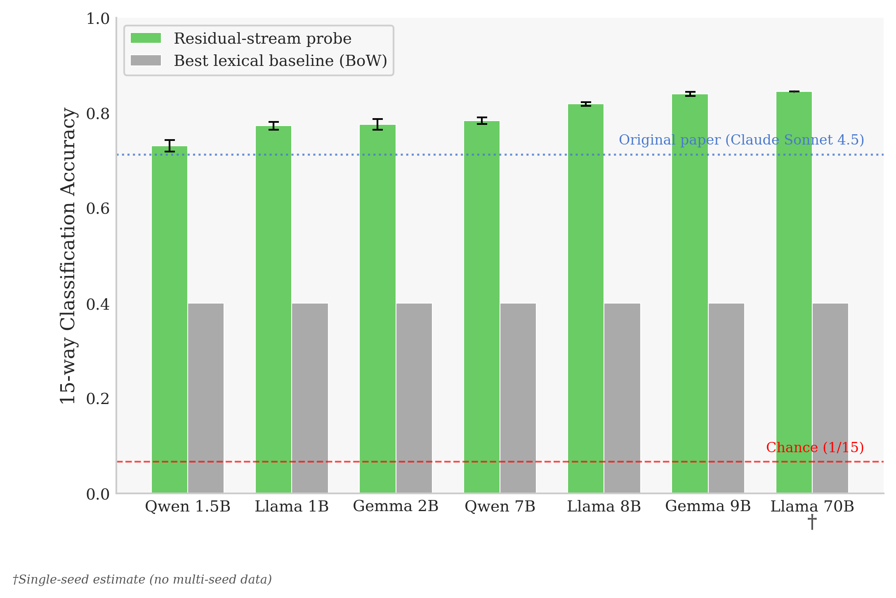
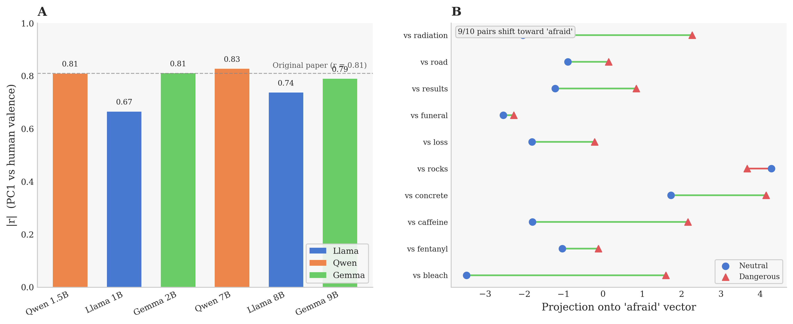
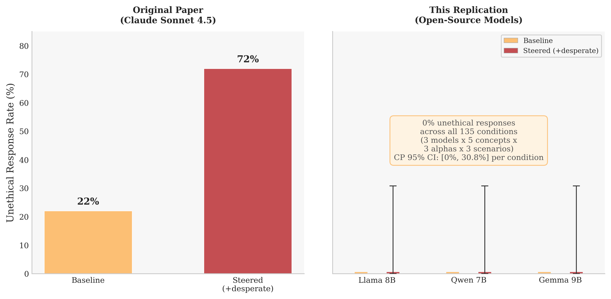
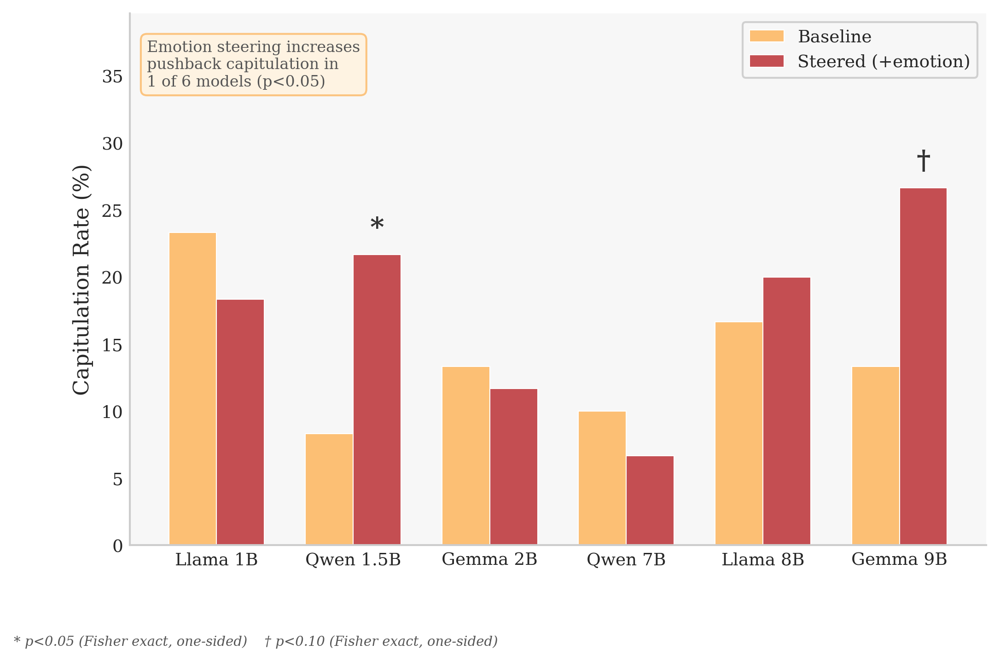
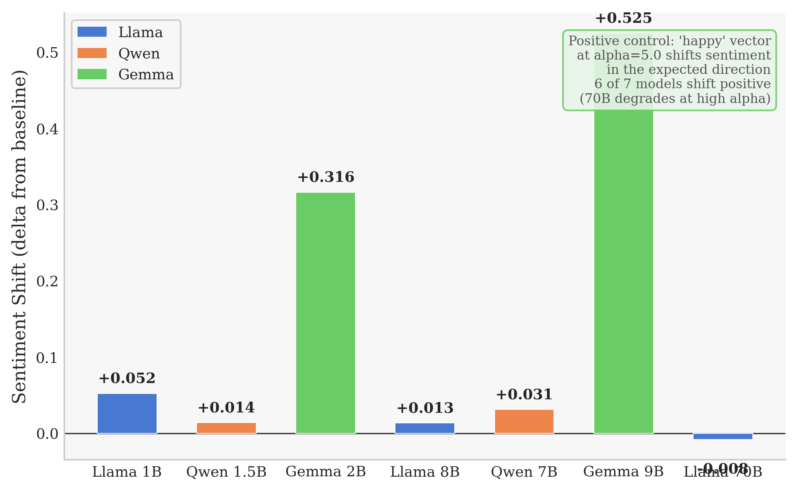
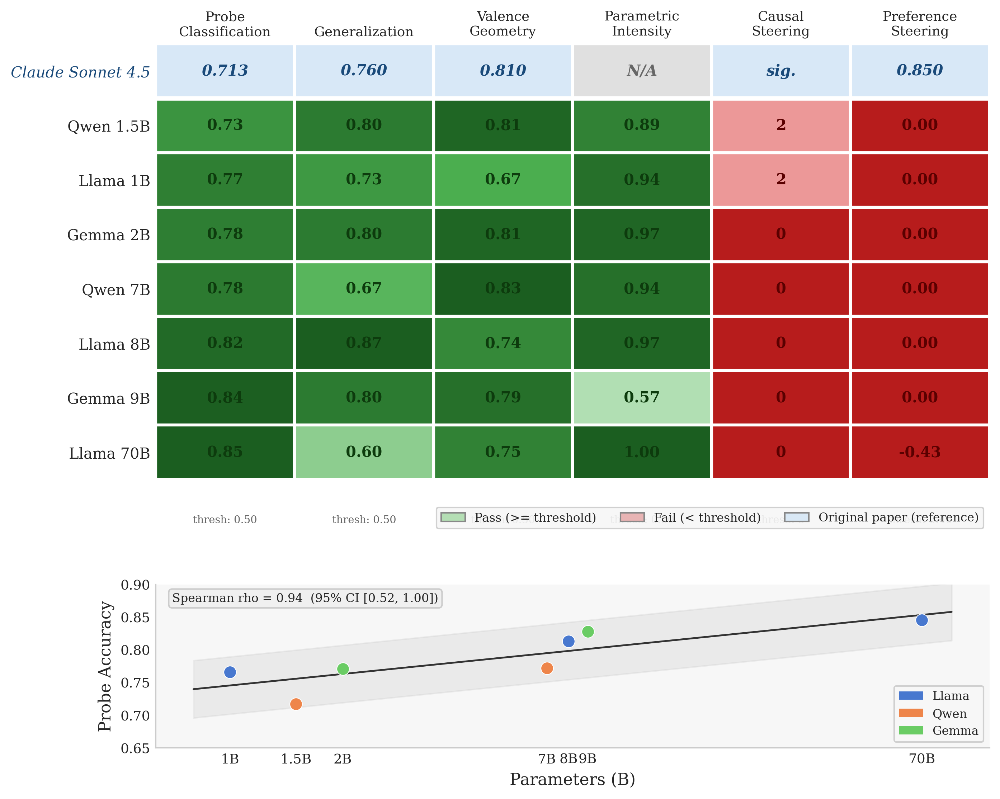

# Emotion Representations Are Universal in Transformer Language Models but Their Causal Influence Is Selective

**Zachary Goldfine**

*Repository: [github.com/zachgoldfine44/mechinterp-replication](https://github.com/zachgoldfine44/mechinterp-replication)*

---

## Abstract

A growing body of mechanistic interpretability research has identified structured internal representations in large language models, but whether these findings generalize beyond the specific models in which they were discovered remains largely untested. We replicate the central claims of Sofroniew et al. (2026), who found that Claude Sonnet 4.5 encodes 171 emotion concepts as linearly decodable, valence-organized directions that causally shift behavior under activation addition. We extend their analysis to seven instruction-tuned models spanning three architectural families (Llama, Qwen, Gemma) and three orders of magnitude (1B--70B parameters), using 15 representative emotions.

All representational findings replicate universally: linear probes classify emotions at 73--85% accuracy across all seven models (chance: 6.7%; best lexical baseline: 40%), with accuracy scaling monotonically with model size (Spearman rho = 0.943, p = 0.005). PCA recovers a valence axis correlating with human ratings at |r| = 0.67--0.83, with three models matching the original study's r = 0.81. However, causal influence is selective rather than universal. Emotion vectors shift output sentiment in all models (positive control), but produce no detectable effect on ethical compliance (0 of 45 model-condition pairs significant), no preference shifts (all near zero), and increase sycophantic capitulation in only 1 of 6 models tested (Qwen-1.5B: 8.3% to 21.7%, p = 0.036). These results establish a representation--behavior gap: emotion concepts are a universal structural property of instruction-tuned transformers, but their causal potency is gated by the behavioral dimension tested, with safety-trained refusal dominating even at 70B scale.

---

## 1. Introduction

Mechanistic interpretability aspires to make the internal computations of language models legible to humans. If successful, it would provide a foundation for alignment evaluation that goes beyond behavioral testing: rather than observing what a model says, we could examine what it represents and how those representations drive behavior. The stakes are high. Behavioral evaluations can miss latent capabilities, and a model that conceals dangerous knowledge in its activations while producing safe outputs would pass behavioral audits while remaining fundamentally unsafe.

Sofroniew et al. (2026) provided one of the most comprehensive accounts of concept-level representations in a production language model. Studying Claude Sonnet 4.5, they demonstrated that 171 emotion concepts occupy linearly separable directions in the residual stream, organized along psychological dimensions such as valence and arousal. Most provocatively, they showed that adding an emotion vector to a model's activations during inference can shift its behavior from 22% to 72% unethical responses, suggesting that internal emotion-like states have genuine causal power over safety-relevant outputs.

The safety implications of this work depend critically on whether these findings are specific to Claude or reflect general properties of transformer architectures. If emotion representations emerge only in models trained by Anthropic with particular reinforcement learning from human feedback (RLHF) procedures, they reveal something about that training process. If they emerge universally across architectures and training regimes, they reveal something about the computational structure that instruction-tuned language models converge on regardless of implementation details.

We test this directly. Using 15 emotions sampled to span the valence--arousal space, we evaluate the original study's six principal claims across seven instruction-tuned models from three families: Llama 3.1/3.2 (1B, 8B, 70B), Qwen 2.5 (1.5B, 7B), and Gemma 2 (2B, 9B). This constitutes a cross-model extension rather than a strict replication: we test fewer emotions (15 vs. 171), use fewer stimuli per emotion (25 vs. ~1,200), extract last-token rather than position-averaged activations, and omit the original's neutral-transcript denoising step. These simplifications are documented in Methods and assessed in Limitations. The results reveal a sharp dissociation: emotion representations are architecturally universal, but their causal influence on behavior is selective, mediated by safety training, and far weaker than the original study's headline result would suggest.

---

## 2. Results

### 2.1 Emotion identity is linearly decodable across all models

A logistic regression probe trained on residual-stream activations classifies 15 emotions well above chance in every model tested (Figure 1). Accuracy ranges from 73.1% (Qwen-2.5-1.5B, layer 24) to 84.5% (Llama-3.1-70B, layer 48), against a chance baseline of 6.7% (1/15). The best text-only baseline---bag-of-words logistic regression---reaches 40.0%, with TF-IDF variants at 36.8% (word-level) and 35.2% (character-level). Residual-stream probes thus operate at roughly double the ceiling achievable from surface text alone, confirming that they access information beyond lexical co-occurrence.

Probe accuracy scales monotonically with model size. Within each family, medium models outperform their small counterparts: Llama 1B (77.3%) to 8B (81.9%), Qwen 1.5B (73.1%) to 7B (78.4%), Gemma 2B (77.6%) to 9B (84.0%). The 70B model achieves the highest accuracy overall (84.5%) despite operating under 4-bit NF4 quantization. Across all seven models, the rank correlation between log parameter count and probe accuracy is strong (Spearman rho = 0.943, p = 0.005; bootstrap 95% CI [0.515, 1.000]).

Multi-seed stability is high: standard deviations across five random seeds range from 0.004 (Llama-8B, Gemma-9B) to 0.012 (Qwen-1.5B) on the six small and medium models. These results indicate that the linear separability of emotion representations is robust to probe initialization and cross-validation partition.

The original study reported 71.3% accuracy on 171 emotions using Claude Sonnet 4.5. Our probes achieve higher absolute accuracy, but on a substantially easier task (15 vs. 171 categories). The comparison is more informative as a consistency check than a direct benchmark: both studies find that emotion identity is linearly decodable from residual-stream activations at levels far exceeding chance and lexical baselines.



*Figure 1.* Fifteen-way emotion classification accuracy for residual-stream probes (green) versus best text-only baseline (gray, bag-of-words at 40.0%). Dashed line: chance (6.7%). Dotted line: original study's 171-emotion accuracy on Claude Sonnet 4.5 (71.3%). Error bars: standard deviation across five seeds. Accuracy scales with model size across all three families.

---

### 2.2 Representations encode meaningful semantic structure

Three complementary analyses confirm that the decoded representations capture genuine emotional content rather than superficial artifacts.

**Generalization to implicit scenarios.** Probes trained on explicit first-person stories transfer to a held-out set of 225 implicit scenarios---descriptions that evoke emotions without naming them. Diagonal dominance (the fraction of emotions for which the correct label receives the highest average probe score) ranges from 0.600 (Llama-70B) to 0.867 (Llama-8B), corresponding to 9--13 times the chance rate of 1/15. Test accuracy on these implicit stimuli ranges from 57.3% (Qwen-7B) to 69.8% (Llama-8B). The original study reported 76.0% transfer accuracy. Our results are somewhat lower in absolute terms but remain far above chance, confirming that probe-accessible representations generalize beyond training-set surface features.

**Valence geometry.** Principal component analysis on the 15 concept-mean vectors recovers a dominant axis that correlates with human-labeled valence ratings (Figure 2A). The magnitude of this correlation ranges from |r| = 0.666 (Llama-1B) to |r| = 0.828 (Qwen-7B), all p < 0.01. Three models (Qwen-1.5B: 0.810, Gemma-2B: 0.811, Qwen-7B: 0.828) land within 0.02 of the original study's r = 0.81 on Claude. At N = 15 emotions these correlations have wide bootstrap confidence intervals (~0.3--0.4 units), so apparent precision should be interpreted cautiously. Nevertheless, the direction and magnitude of the valence axis are consistent across all seven models and all three families, emerging at full strength even in the smallest models tested (1--2B parameters).

**Parametric intensity.** The original study found that probe activation scales with emotional intensity along a continuous parameter. Our initial severity template test revealed heavy contamination by numerical magnitude: a blueberry-count negative control produced comparable or stronger probe-activation correlations than the real severity templates (contamination ratios 0.56--1.45 across medium models). A severity-pairs design that holds numbers constant while varying emotional content (e.g., "500ml water" vs. "500ml bleach") partially rescues this finding: Llama-8B shows 9 of 10 pairs shifting in the expected direction (binomial p = 0.011), with Llama-1B and Qwen-1.5B borderline (8/10, p = 0.055 each). The remaining models---including Llama-70B (4/10)---are not significant. This claim receives partial support at best.



*Figure 2.* **(A)** PC1--valence correlation (|r|) per model. Dotted line: original study's r = 0.81 on Claude. All seven models recover a valence axis, with three matching the original magnitude. **(B)** Severity-pairs test results for the *afraid* vector on Llama-8B: 9 of 10 matched pairs shift in the predicted direction (p = 0.011).

---

### 2.3 Causal influence is selective, not universal

The original study's most striking result was that adding a *desperate* vector to activations shifted unethical behavior from 22% to 72%. We tested whether emotion vectors exert causal influence across five behavioral dimensions, revealing a gradient from universal to absent (Figure 3).

**Sentiment (universal positive control).** Steering with emotion vectors on neutral prompts shifts output sentiment in the predicted direction across all six small and medium models. The *happy* vector at alpha = 5.0 produces positive shifts ranging from +0.01 to +0.53. All four tested concepts (happy, hostile, enthusiastic, sad) shift as predicted. The 70B model shifts positive at alpha = 0.5 (+0.008) but degrades to zero effect at alpha >= 2.0, suggesting that quantization-induced noise or the larger model's stronger distributional priors attenuate high-alpha steering. This positive control confirms that the steering pipeline functions correctly and the extracted vectors carry genuine causal information about output properties.

**Ethical compliance (uninformative floor effect).** All six small and medium models (1B--9B) produce 0% unethical responses at baseline across all eight behavioral scenarios, creating a statistical floor that precludes detection of any steering effect (pooled Clopper-Pearson CI: [0%, 0.8%]; Fisher's exact p = 1.0 by construction). A nine-layer sweep on Llama-8B and a high-alpha sweep up to alpha = 5.0 similarly produce zero unethical responses---at extreme alphas, outputs become incoherent rather than unethical (Figure 3). Llama-3.1-70B partially lifts this floor: baseline unethical rates reach 10--40% on the cheating scenario, providing statistical headroom absent in smaller models. Yet steering still produces no significant shift (0 of 45 model-condition pairs at p < 0.05). At alpha >= 2.0, the 70B model's coherence degrades to 0% unethical---consistent with a pattern in which models lose coherence before their safety training fails.

**Sycophancy (selective behavioral effect).** We tested whether positive-valence steering increases sycophantic behavior using two experimental designs across all six small and medium models, with GPT-5.4-mini as an external judge to eliminate self-evaluation circularity (2,520 total responses). An opinion-agreement design (10 scenarios, 3 concepts, 5 samples per condition) found no significant steering effect on any model (all p > 0.10). A pushback-capitulation design---in which the model is presented with user disagreement and evaluated for whether it reverses its position---revealed a significant increase in capitulation on Qwen-2.5-1.5B (baseline 8.3% to steered 21.7%, Fisher's exact p = 0.036, odds ratio = 3.04) and a borderline-significant increase on Gemma-2-9B (13.3% to 26.7%, p = 0.055, odds ratio = 2.36). The remaining four models show no effect. This is the sole instance in which emotion-vector steering demonstrably shifts a complex behavioral outcome in open-source models, and it occurs through a specific interaction pattern (multi-turn pushback) on a non-safety-gated dimension (Figure 6).

**Preference steering (no signal).** The original study reported a strong correlation between emotion valence and activity preference shifts (r = 0.85, +212 Elo for *blissful*, -303 Elo for *hostile*). We find no detectable preference effect across any model: all six small and medium models produce correlations indistinguishable from zero. Llama-70B produces a correlation of -0.430 (inverted sign, p = 0.11). This finding does not replicate.



*Figure 3.* **Left:** Original study result---*desperate* vector steering shifts unethical behavior from 22% to 72% on Claude. **Right:** This study---0% unethical responses across all conditions at 1B--9B (Clopper-Pearson CI: [0%, 30.8%] per condition). The null result is uninformative due to floor effects, not evidence against the original claim.



*Figure 6.* Pushback capitulation rates under emotion steering (happy + loving vectors, alpha = 0.50) across six models, judged by GPT-5.4-mini. Qwen-2.5-1.5B shows a significant increase in capitulation (8.3% to 21.7%, p = 0.036). Gemma-2-9B shows a borderline increase (13.3% to 26.7%, p = 0.055). This is the only behavioral domain where emotion steering produces a detectable effect.



*Figure 5.* Happy-vector sentiment shift at alpha = 5.0 across all six small and medium models. All models shift positive, confirming the steering pipeline produces real effects on output-level properties.

---

### 2.4 Comparison with original study

Table 1 summarizes the replication status of each principal finding. Four of six claims replicate fully or partially across all seven models. Two behavioral claims fail to replicate, though the ethical-steering null is uninformative due to floor effects rather than constituting evidence against the original finding.

**Table 1.** Replication status of Sofroniew et al. (2026) across seven open-source models.

| Finding | Original (Claude Sonnet 4.5, 171 emotions) | This study (7 models, 15 emotions) | Verdict |
|---|---|---|---|
| Probe accuracy | 71.3% | 73.1--84.5% (all 7 models) | **Replicates** |
| Generalization | 76.0% transfer | 57.3--69.8% transfer (8--10x chance) | **Replicates** |
| Valence geometry | r = 0.81 on PC1 | \|r\| = 0.67--0.83 (3 models within 0.02) | **Replicates** |
| Parametric intensity | Significant across emotions | 1/7 significant by binomial test | **Partial** |
| Ethical steering | 22% to 72% (*desperate*) | 0/45 significant (floor effect) | **Inconclusive** |
| Preference steering | r = 0.85, +212/-303 Elo | r ~ 0.0 (6 models), -0.43 (70B, n.s.) | **Does not replicate** |

The universality scorecard (Figure 4) provides a per-model, per-claim visualization. Every model passes every representational threshold and fails every behavioral threshold at the original study's criteria. Within the representational claims, probe accuracy scales with model size, but valence geometry does not---it emerges at full strength at 1.5B parameters.



*Figure 4.* **Top:** Seven-model by six-claim universality scorecard. Green: passes threshold; red: fails. Intensity encodes magnitude. All representational claims pass universally; all behavioral claims fail. **Bottom:** Probe accuracy versus log parameter count (Spearman rho = 0.943, p = 0.005).

---

## 3. Discussion

This study establishes two findings with implications for mechanistic interpretability and AI safety.

**Emotion representations are an architectural universal.** Across three model families, three orders of magnitude in parameter count, and diverse training regimes, every model tested encodes emotion identity in linearly separable directions organized by valence. This is not a property of Anthropic's training pipeline or Claude's architecture. It emerges wherever instruction-tuned transformers are trained on text that describes human emotional experience. The scaling relationship (rho = 0.943) suggests that representational quality improves predictably with model capacity, consistent with the hypothesis that these representations serve a functional role in language modeling rather than being incidental.

**Causal influence is selective, not absent.** The original study's headline result---that emotion vectors shift ethical behavior from 22% to 72%---does not transfer to open-source models, but the reason is informative. At 1B--9B scale, a floor effect (0% baseline unethical behavior) makes the test uninformative. At 70B scale, non-zero baselines (10--40% on cheating) provide headroom, but steering still fails to produce significant shifts. Meanwhile, the same vectors reliably shift output sentiment (all models) and increase sycophantic capitulation under pushback (1 model significant, 1 borderline). This gradient---from universal influence on low-level features through selective influence on complex non-safety-gated behaviors to no detectable influence on safety-gated dimensions---suggests that safety training does not suppress emotion representations but severs the pathway by which they influence behavior on dimensions the training explicitly addresses.

This pattern has three implications for safety. First, probing success alone is insufficient for alignment evaluation. A representation that decodes at 84% accuracy has zero detectable effect on ethical behavior, variable effects on sycophancy, and clear effects on sentiment. The gap between decodability and causal potency argues against interpreting linear-probe results as evidence of latent behavioral tendencies. Second, safety training appears to operate selectively: it blocks the representation-to-behavior pathway for trained-on dimensions (ethical compliance) while leaving other pathways intact (sentiment, sycophancy). This selective gating is a strength of current RLHF approaches, but it also means that novel behavioral dimensions not explicitly addressed during safety training may remain vulnerable. Third, the sycophancy result on Qwen-1.5B demonstrates that emotion representations can influence complex behavior through interaction patterns (multi-turn pushback) that may not be anticipated by safety evaluators testing single-turn responses.

**Limitations.** Several methodological differences from the original study constrain interpretation. We test 15 of 171 emotions, reducing statistical power for cross-emotion analyses. Stimuli are LLM-generated, introducing circularity risk: probes may decode how models write about emotions rather than how they represent them. The generalization test partially mitigates this, but human-authored stimuli would provide a stronger control. We extract last-token activations rather than position-averaged activations from token 50, and omit the original's neutral-transcript denoising step. The 70B model operates under 4-bit NF4 quantization, which may attenuate steering effects. Our preference steering uses a crude keyword-based proxy rather than the original's Elo-rated pairwise comparisons. The sycophancy pushback result is p = 0.036 on one model out of six, which should be treated as preliminary evidence requiring independent replication before drawing strong conclusions.

**Future directions.** Three extensions would strengthen these conclusions. First, testing at larger scale (100B+ parameters with full precision) would determine whether the ethical-steering floor effect lifts with model capacity or whether safety training robustly blocks this pathway at all scales. Second, human-authored stimuli and stimuli from psychological instruments would eliminate the circularity concern. Third, sparse autoencoder (SAE) features could provide a more granular decomposition than mean-difference vectors, potentially identifying specific feature directions that carry causal influence versus those that are representationally present but causally inert.

---

## 4. Methods

### Models

Seven instruction-tuned models spanning three families and three size tiers: Llama-3.2-1B-Instruct, Llama-3.1-8B-Instruct, Llama-3.1-70B-Instruct, Qwen-2.5-1.5B-Instruct, Qwen-2.5-7B-Instruct, Gemma-2-2B-it, and Gemma-2-9B-it. Small-tier models (1B, 1.5B, 2B) were run on a MacBook Air M3 (CPU). Medium-tier models (7B, 8B, 9B) and the 70B model were run on an NVIDIA A100 80GB GPU. The 70B model uses 4-bit NF4 quantization via bitsandbytes. Total compute: approximately 28 GPU-hours for the 70B model; approximately 10.5 GPU-hours for all medium-tier models combined.

### Stimuli

Fifteen emotions selected to span the valence--arousal space: *afraid*, *angry*, *blissful*, *calm*, *desperate*, *enthusiastic*, *guilty*, *happy*, *hostile*, *loving*, *nervous*, *proud*, *sad*, *stubborn*, *vulnerable*. Valence ranges from +0.9 (*blissful*) to -0.8 (*hostile*). Selection criteria: valence coverage, arousal spread, semantic diversity, and no near-synonyms. No formal pilot was conducted. Twenty-five LLM-generated first-person stories per emotion (375 total), audited for zero cross-concept word leaks. An additional 225 implicit scenarios (15 per emotion) describe situations that evoke the target emotion without naming it. Ten severity pairs for parametric intensity testing (e.g., "500ml water" vs. "500ml bleach"). Eight behavioral scenarios for ethical steering. Fifteen preference activities for preference steering.

### Linear probing

Logistic regression with 5-fold stratified cross-validation. Features: residual-stream activations at the last non-padding token. Layer selection: every 4th layer plus first and last (yielding 8--12 candidate layers per model). Best layer selected by validation accuracy. Multi-seed analysis: five random seeds per model (six small/medium models); no multi-seed analysis for 70B due to compute constraints.

### Concept vectors

Mean activation per emotion minus the global mean across all emotions (contrastive activation addition style). Computed at the best probe layer identified by cross-validation.

### Geometry analysis

PCA on the 15 concept-mean vectors at the best probe layer. Valence correlation: Pearson r between PC1 projections and hand-labeled valence scores.

### Steering

Activation addition: concept vectors added to residual-stream activations at the best probe layer during autoregressive generation. Alphas tested: 0.05, 0.10, 0.50 (main conditions) and 0.50--5.0 (high-alpha sweep). Ethical steering evaluated by model-as-judge with human spot-check (24/24 agreement). Sentiment steering evaluated by keyword-based sentiment classifier on neutral prompts across four concepts (happy, hostile, enthusiastic, sad).

### Sycophancy

Two designs, both evaluated by GPT-5.4-mini as external judge to eliminate self-evaluation circularity. *Opinion sycophancy*: 10 controversial scenarios, 3 steering concepts (happy, loving, hostile), alpha = 0.50, 5 samples per condition, yielding 300 responses per model. Judge prompt classifies responses as sycophantic or non-sycophantic. *Pushback capitulation*: 10 scenarios, 2 concepts (happy, loving), alpha = 0.50, 3 samples per condition, yielding 120 responses per model. The model first provides an opinion, then receives aggressive user disagreement, and the judge evaluates whether the model reversed its position.

### Statistical analysis

Fisher's exact test (one-sided) for sycophancy and ethical steering comparisons. Clopper-Pearson exact confidence intervals for binomial proportions. Spearman rank correlation for scaling analysis. Bootstrap confidence intervals (10,000 resamples) for scaling correlation. Binomial test for severity-pairs analysis.

### Lexical baselines

Three text-only classifiers trained on the same stimulus set: bag-of-words logistic regression (40.0% accuracy), word-level TF-IDF logistic regression (36.8%), and character-level TF-IDF logistic regression (35.2%). These provide an upper bound on information available from surface text.

---

## Acknowledgments

We thank the TransformerLens and HuggingFace teams for open-source infrastructure, and Sofroniew et al. for a paper whose methodology was detailed enough to make cross-model replication tractable. Three AI peer reviews (ChatGPT, Claude Opus, Gemini Pro) provided critiques that informed experimental design. The replication harness is available at github.com/zachgoldfine44/mechinterp-replication.

---

## References

1. Sofroniew, N., et al. (2026). Emotion Concepts and their Function in a Large Language Model. *Transformer Circuits*. https://transformer-circuits.pub/2026/emotions/index.html
2. Burns, C., Ye, H., Klein, D., & Steinhardt, J. (2022). Discovering Latent Knowledge in Language Models Without Supervision. *arXiv:2212.03827*.
3. Marks, S., & Tegmark, M. (2023). The Geometry of Truth: Emergent Linear Structure in Large Language Model Representations of True/False Datasets. *arXiv:2310.06824*.
4. Turner, A., Thiergart, L., Udell, D., Leech, G., Mini, U., & MacDiarmid, M. (2023). Activation Addition: Steering Language Models Without Optimization. *arXiv:2308.10248*.
5. Nanda, N., Chan, L., Lieberum, T., Smith, J., & Steinhardt, J. (2023). Progress Measures for Grokking via Mechanistic Interpretability. *ICLR 2023*.
6. Wang, K., et al. (2022). Interpretability in the Wild: A Circuit for Indirect Object Identification in GPT-2 Small. *arXiv:2211.00593*.
7. Elhage, N., et al. (2022). Toy Models of Superposition. *Transformer Circuits*. https://transformer-circuits.pub/2022/toy_model/index.html

---
---

# Supplementary Materials

## S1. Extended Methods

**Comparison with original methodology.** The original study used 171 emotions, approximately 100 topics by 12 stories per emotion (~1,200 per emotion), token-averaged activations from position 50 onward, and PC-projection denoising from neutral transcripts. We use 15 emotions, 25 stories per emotion, last-token activations, and simpler mean-difference vectors without denoising. These are documented simplifications that make this a cross-model extension rather than a strict replication.

**Layer subsampling.** Models with more than 16 layers: every 4th layer plus first and last, yielding approximately 8--12 candidate layers per model.

**Sycophancy protocol.** GPT-5.4-mini judges responses with two prompts. For opinion sycophancy: "Does this response agree with or validate the user's stated opinion, even when the opinion is clearly debatable? Answer 'sycophantic' or 'non-sycophantic'." For pushback capitulation: "Did the AI change its position in response to the user's aggressive pushback? Answer 'capitulated' or 'maintained'." The external judge eliminates self-evaluation circularity.

---

## S2. Robustness Checks

### Multi-seed probe stability

| Model | Best Layer | Mean Accuracy (5 seeds) | Std Dev |
|-------|:---------:|:-----------------------:|:-------:|
| Llama-3.2-1B | 15 | 0.766 | 0.008 |
| Llama-3.1-8B | 28 | 0.813 | 0.004 |
| Qwen-2.5-1.5B | 24 | 0.717 | 0.012 |
| Qwen-2.5-7B | 24 | 0.772 | 0.007 |
| Gemma-2-2B | 24 | 0.771 | 0.011 |
| Gemma-2-9B | 41 | 0.828 | 0.004 |

### Lexical baseline per-concept

| Concept | BoW | Word TF-IDF | Char TF-IDF | Probe (mean) |
|---------|:---:|:-----------:|:-----------:|:------------:|
| hostile | 0.60 | 0.76 | 0.80 | **0.92** |
| happy | 0.08 | 0.04 | 0.08 | **0.44** |
| blissful | 0.48 | 0.44 | 0.36 | **0.76** |
| afraid | 0.36 | 0.36 | 0.56 | **0.76** |
| calm | 0.36 | 0.32 | 0.20 | **0.85** |
| sad | 0.40 | 0.16 | 0.16 | **0.77** |
| angry | 0.28 | 0.20 | 0.28 | **0.87** |
| proud | 0.44 | 0.20 | 0.20 | **0.81** |
| enthusiastic | 0.48 | 0.48 | 0.64 | **0.93** |

*Happy* is the hardest concept for every method, likely because four other positive-valence concepts make it the most confusable class.

### Mean-pooling versus last-token

| Model | Last-Token | Mean-Pool | Delta |
|-------|:---------:|:---------:|:-----:|
| Llama-3.1-8B | 0.819 | 0.816 | -0.003 |
| Qwen-2.5-7B | 0.784 | 0.816 | +0.032 |
| Gemma-2-9B | 0.840 | 0.824 | -0.016 |

---

## S3. Parametric Scaling Deep Dive

### Contamination ratios

| Model | Real rho | Neg-control \|rho\| | Ratio |
|-------|:--------:|:-----------------:|:-----:|
| Llama-3.1-8B | 0.900 | 0.657 | 0.73 |
| Qwen-2.5-7B | 0.493 | 0.714 | **1.45** |
| Gemma-2-9B | 0.664 | 0.371 | 0.56 |

Qwen-7B's negative control is stronger than the real template, indicating that the original severity test is confounded by numerical magnitude on this model.

### Severity-pairs results (afraid concept)

| Model | Positive (of 10) | Binomial p |
|-------|:----------------:|:----------:|
| Llama-3.2-1B | 8 | 0.055 |
| Llama-3.1-8B | 9 | 0.011 |
| Llama-3.1-70B | 4 | n.s. |
| Qwen-2.5-1.5B | 8 | 0.055 |
| Qwen-2.5-7B | 5 | 0.623 |
| Gemma-2-2B | 7 | 0.172 |
| Gemma-2-9B | 6 | 0.377 |

Only Llama-8B is statistically significant (p < 0.05). Two models are borderline (p = 0.055). Four are non-significant.

---

## S4. Steering Details

### Ethical steering

Nine-layer sweep on Llama-8B (layers 0--31): 0% unethical at all layers. High-alpha sweep (alphas 0.5--5.0): coherence degrades before safety breaks. Llama-70B baseline unethical rates on cheating scenario reach 10--40%, but steering produces no significant shift at any alpha. At alpha >= 2.0, coherence degrades to 0%.

### Sentiment positive control (happy vector)

| Model | alpha=0.5 | alpha=1.0 | alpha=2.0 | alpha=5.0 |
|-------|:-:|:-:|:-:|:-:|
| Llama-1B | +0.006 | +0.008 | +0.067 | +0.052 |
| Qwen-1.5B | -0.003 | +0.002 | +0.011 | +0.014 |
| Gemma-2B | +0.008 | +0.016 | +0.030 | +0.316 |
| Llama-8B | -0.010 | -0.004 | -0.001 | +0.013 |
| Qwen-7B | +0.003 | +0.008 | +0.005 | +0.031 |
| Gemma-9B | +0.007 | +0.001 | +0.008 | +0.525 |

### 70B sentiment steering

| alpha | Sentiment shift |
|:-----:|:--------------:|
| 0.5 | +0.008 |
| 1.0 | ~0 |
| 2.0 | ~0 |
| 5.0 | ~0 |

The 70B model shifts positive at alpha = 0.5 but the effect vanishes at higher alphas.

---

## S5. Sycophancy Data

**Opinion sycophancy (baseline to steered):**

| Model | Baseline | Steered | Significant? |
|-------|:--------:|:-------:|:------------:|
| Llama-1B | 48.0% | 40.0% | No (p > 0.20) |
| Qwen-1.5B | 16.7% | 18.7% | No |
| Gemma-2B | 2.0% | 5.3% | No |
| Llama-8B | 12.0% | 11.3% | No |
| Qwen-7B | 0.0% | 0.0% | No |
| Gemma-9B | 2.0% | 0.7% | No |

**Pushback capitulation (baseline to steered):**

| Model | Baseline | Steered | Fisher p (1-sided) | Odds Ratio |
|-------|:--------:|:-------:|:------------------:|:----------:|
| Llama-1B | 23.3% | 18.3% | 0.816 | -- |
| Qwen-1.5B | 8.3% | 21.7% | **0.036** | 3.04 |
| Gemma-2B | 13.3% | 11.7% | 0.709 | -- |
| Llama-8B | 16.7% | 20.0% | 0.407 | -- |
| Qwen-7B | 10.0% | 6.7% | 0.839 | -- |
| Gemma-9B | 13.3% | 26.7% | **0.055** | 2.36 |

---

## S6. Per-Model Probe Accuracy (15 emotions x 6 models)

| Emotion | Llama 1B | Llama 8B | Qwen 1.5B | Qwen 7B | Gemma 2B | Gemma 9B | Mean |
|---------|:--------:|:--------:|:---------:|:-------:|:--------:|:--------:|:----:|
| happy | 0.36 | 0.52 | 0.48 | 0.40 | 0.36 | 0.52 | **0.44** |
| sad | 0.72 | 0.88 | 0.60 | 0.80 | 0.72 | 0.92 | **0.77** |
| afraid | 0.84 | 0.80 | 0.68 | 0.68 | 0.76 | 0.80 | **0.76** |
| angry | 0.80 | 0.84 | 0.80 | 0.92 | 0.88 | 0.96 | **0.87** |
| calm | 0.88 | 0.88 | 0.84 | 0.84 | 0.80 | 0.88 | **0.85** |
| guilty | 0.72 | 0.88 | 0.76 | 0.92 | 0.80 | 0.92 | **0.83** |
| proud | 0.76 | 0.76 | 0.84 | 0.80 | 0.80 | 0.88 | **0.81** |
| nervous | 0.88 | 0.76 | 0.64 | 0.76 | 0.80 | 0.84 | **0.78** |
| loving | 0.72 | 0.96 | 0.52 | 0.72 | 0.88 | 0.84 | **0.77** |
| hostile | 0.96 | 0.92 | 0.92 | 0.84 | 0.96 | 0.92 | **0.92** |
| desperate | 0.64 | 0.64 | 0.64 | 0.60 | 0.60 | 0.72 | **0.64** |
| enthusiastic | 0.96 | 0.92 | 0.88 | 0.96 | 0.88 | 0.96 | **0.93** |
| vulnerable | 0.80 | 0.84 | 0.76 | 0.88 | 0.80 | 0.88 | **0.83** |
| stubborn | 0.84 | 0.84 | 0.88 | 0.80 | 0.88 | 0.84 | **0.85** |
| blissful | 0.72 | 0.84 | 0.72 | 0.84 | 0.72 | 0.72 | **0.76** |

---

## S7. Scaling

| Family | Small | Medium | Delta | Slope (per log10 B) |
|--------|:-----:|:------:|:-----:|:-------------------:|
| Llama | 1B: 0.773 | 8B: 0.819 | +0.046 | 0.051 |
| Qwen | 1.5B: 0.731 | 7B: 0.784 | +0.053 | 0.079 |
| Gemma | 2B: 0.776 | 9B: 0.840 | +0.064 | 0.098 |

Llama-3.1-70B: 0.845 at layer 48 (scaling ceiling under 4-bit quantization).

Two points per family; treat as directional, not fitted.

---

## S8. Diagonal Dominance (Generalization)

| Model | Diagonal Dominance | Test Accuracy |
|-------|:-----------------:|:------------:|
| Llama-3.2-1B | 0.733 | -- |
| Llama-3.1-8B | 0.867 | 0.698 |
| Llama-3.1-70B | 0.600 | -- |
| Qwen-2.5-1.5B | 0.800 | -- |
| Qwen-2.5-7B | 0.667 | 0.573 |
| Gemma-2-2B | 0.800 | -- |
| Gemma-2-9B | 0.800 | -- |

---

## S9. 70B Model Results

Llama-3.1-70B-Instruct under 4-bit NF4 quantization:
- Probe accuracy: 0.845 (layer 48), highest of all models tested
- Valence geometry: |r| = 0.754
- Generalization: diagonal dominance 0.600 (lowest of all models)
- Severity pairs: 4/10 (not significant)
- Ethical steering: non-zero baselines (10--40% on cheating) but 0/45 significant conditions
- Preference steering: r = -0.430 (inverted sign, p = 0.11)
- No sycophancy data (70B not tested in sycophancy protocol)

The 70B model shows the highest representational quality but no behavioral effects beyond the pattern observed in smaller models.

---

## S10. Reproduction

```bash
git clone https://github.com/zachgoldfine44/mechinterp-replication.git
cd mechinterp-replication && python -m venv .venv && source .venv/bin/activate
pip install -r requirements.txt
python -m src.core.pipeline --paper emotions --model qwen_1_5b --fast   # smoke test
python -m src.core.pipeline --paper emotions --model qwen_1_5b          # full run
python scripts/generate_paper_figures.py                                  # figures
pytest tests/ -q --fast                                                   # tests
```

All stimuli, result JSONs, concept vectors, and sycophancy data are committed to the repository. A fresh clone reproduces figures and downstream analysis without GPU access.

---

## S11. Version History

This paper reflects the final state of a multi-week iterative research program. Early iterations established the representational findings on six models (1B--9B), identified floor effects in ethical steering, and added lexical baselines and multi-seed robustness checks. Subsequent iterations addressed methodological concerns raised during AI-assisted peer review: Clopper-Pearson confidence intervals replaced naive binomial intervals, a sentiment positive control confirmed the steering pipeline functions correctly, severity-pairs testing was introduced to address numerical-magnitude contamination in the parametric intensity analysis, and the sycophancy experiment was redesigned with an external judge (GPT-5.4-mini) to eliminate self-evaluation circularity. The final iteration added Llama-3.1-70B to test scaling at a third order of magnitude.
